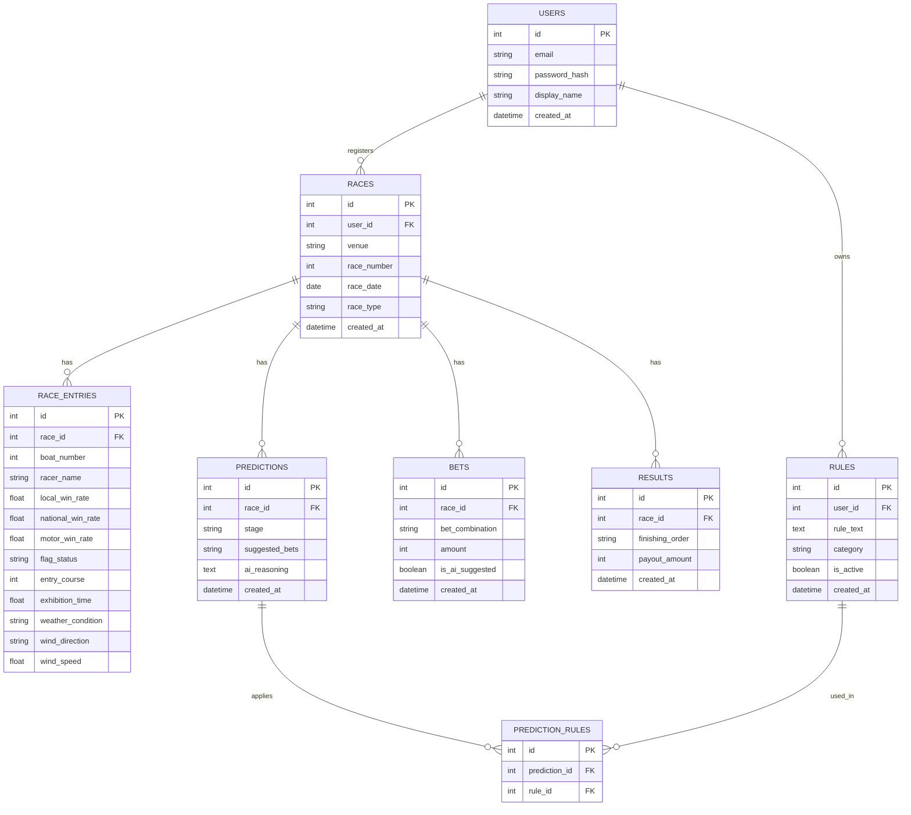
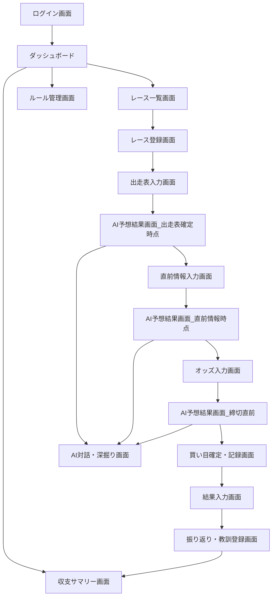

# 詳細設計書（Detailed Design）

## 1. システム構成

- フロントエンド：React（PWA対応、レスポンシブデザイン）
- バックエンド：Python（FastAPI）
- データベース：Supabase（PostgreSQL）
- AI連携：Claude API（予想生成・チャット深掘り機能）
- デプロイ：Vercel（フロント）／Render（バックエンド）／Supabase（DB）

## 2. データベース設計（ER図）

### テーブル補足
- `RACES.race_type` は「一般戦／SG／G1」等を格納し、レース種別ごとの精度集計に利用する。
- `PREDICTIONS.stage` は「entry_confirmed（出走表確定時点）」「pre_race（直前情報公開時点）」「final（締切直前）」の3値を想定。
- `BETS.is_ai_suggested` によって、実際の買い目とAI提案買い目を区別し、収支シミュレーション比較に利用する。
- `RULES` はユーザーごとに独立して管理し、`is_active` フラグでAI予想への反映有無を切り替え可能とする。

## 3. 画面遷移図

## 4. AI予想生成フロー（概要）

1. ユーザーが出走表を入力すると、システムはRules（is_active=trueのもの）と出走表データをまとめてClaude APIに送信し、第1段階の予想（買い目・サマリー根拠）を生成する。
2. 直前情報が入力されると、第1段階の予想結果＋新規データを合わせて再度Claude APIに送信し、第2段階の予想に更新する。
3. 最終オッズが入力されると、同様に第3段階（最終）の予想を生成し、これを「確定予想」としてBETSテーブルに保存可能にする。
4. 各段階の予想はPREDICTIONSテーブルに履歴として保存し、後から「予想がどう変化したか」を振り返れるようにする。

## 5. セキュリティ防衛仕様

| 項目 | 対応方針 |
|------|----------|
| パスワード保護 | bcryptによるハッシュ化を実施し、平文保存は行わない |
| 認証方式 | JWT（JSON Web Token）によるセッション管理。トークンの有効期限を設定し、期限切れ時は再ログインを要求 |
| アクセス制御 | 全APIエンドポイントでユーザーIDに基づくデータフィルタリングを実施し、他ユーザーのレース・ルール・収支データへのアクセスを禁止 |
| 通信の暗号化 | フロント・バックエンド間の通信はHTTPS必須（Vercel／Renderの標準証明書を利用） |
| SQLインジェクション対策 | ORM（SQLAlchemy等）を使用し、生SQLの文字列結合を行わない |
| APIキー管理 | Claude APIキーはバックエンドの環境変数として管理し、フロントエンドには一切露出させない |
| CORS設定 | フロントエンドのオリジンのみ許可するCORSポリシーを設定 |
| 入力値検証 | Pydanticモデル等によるリクエストボディのバリデーションを全エンドポイントで実施 |

## 6. モバイル対応（PWA）方針
- manifest.jsonとService Workerを実装し、ホーム画面への追加・オフラインキャッシュの基本対応を行う。
- レイアウトはTailwind CSS等を用いてモバイルファーストで設計し、レース入力・収支確認等の主要操作をスマートフォンでも快適に行えるようにする。
